# OverTheWire: Bandit

Bandit is an OverTheWire lab that focuses on the shell (SSH).
<hr/>
**The levels' instructions, hints, and connection info can be found on the official [OverTheWire - Bandit](https://overthewire.org/wargames/bandit/) page.**
<hr/>

* I used a Kali Linux VM to solve all the levels.

## Level 0

I connected to the lab using this command:

```$ ssh bandit0@bandit.labs.overthewire.org -p 2220``` 

SSH is used for remote connections. Here I'm connecting to bandit.labs.overthewire.org using port 2220 with username bandit0.

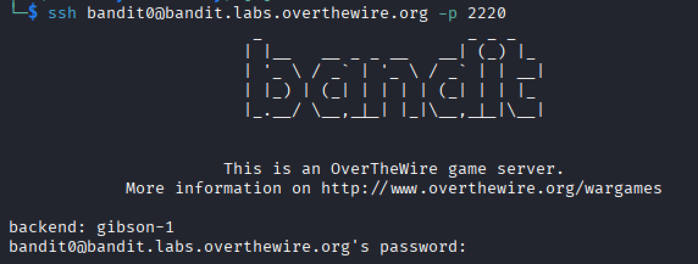

According to the instructions, the password is bandit0.

After entering the password, we're ready to go to the next Level.

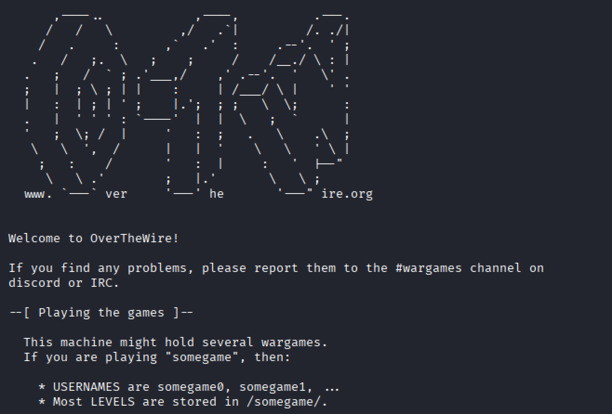

<hr/>

## Level 0 -> Level 1

Next level's password is stored in a file called _readme_ inside the home directory.

In order to visualize current directory's contents, we can use  ```ls ```:

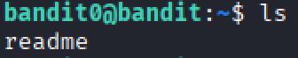

This displays the _readme_ file. To see what's inside, we can use  ```cat```, which is used, among other things, to display file content:
```$ cat readme```

This outputs the password.

To access the next level, we first exit and then run the same command as we did at Level 0, but using bandit1 with the new password:
```bash
$ exit
$ ssh bandit1@bandit.labs.overthewire.org -p 2220
```

If we wish to empty the terminal, we can use the command ```clear```.

<hr/>

## Level 1 -> Level 2

To find the file located in -:

- We make sure it's in the current working directory.
```$ ls```

- We visualize its contents, which in this case is the password.
```$ cat ./-```

In Linux, dashes (-) are used to specify options for commands. If we were to use the dash alone with ```cat```, the command would remain executing.

```./``` is the file's path, where ```.``` is the current directory, so here we're stating that we're dealing with a file.

<hr/>

## Level 2 -> Level 3

Now the password is stored in a file called _--spaces in this filename--_.

Similar to the single dash, double hyphens are used to specify options. Particularly, double hyphens are often used as the longer written form of the single dash.

This time we also have to deal with spaces; typically the command line will take spaces as different arguments. In order to counter this, we surround the filename with quotes.
```$ cat ./"--spaces in this filename--"```

This gives us this level's password.

<hr/>

## Level 3 -> Level 4

First we visualize the current directory:
```$ ls```

Here, we have two choices: 

1. We go to the _inhere_ directory using ```cd```:

```$ cd inhere```

In this level, the password is stored in a hidden file. To show its name, we use the ```-a``` (all) flag after ```ls```.

```$ ls -a```

There, we find a file named _...Hiding-From-You_.

Finally, we display the contents using ```cat```:
```$ cat ...Hiding-From-You```

2. We can print the file's contents without changing directories using paths:

We visualize _inhere_'s contents:
```$ ls -a inhere```

Then we output the desired file's contents:
```$ cat inhere/...Hiding-From-You```

<hr/>

## Level 4 -> Level 5

Next level's password is stored in the only human-readable file in inhere.

```bash
$ cd inhere
$ find . -type f -printf "\n\n" -exec cat {} \;
```
Here we move to the _inhere_ directory and look for regular files. These files' contents are then displayed with two newlines between them for easier differentiation.
<hr/>

## Level 5 -> Level 6

Password is stored in the _inhere_ directory, is human-readable, is 1033 bytes, and isn't executable:

```$ find . -type f ! -executable -size 1033c -printf "\n\n" -exec cat {} \;```

From the _inhere_ directory, this searches for regular files that aren't executable, have a size of 1033 bytes, and prints them with two newlines between them.

<hr/>

## Level 6 -> Level 7

File is stored somewhere owned by user bandit7, owned by group bandit6, 33 bytes in size

```$ find / -type f -size 33c -group bandit6 -user bandit7 -printf "\n\n" -exec cat {} \;```
This looks in root (to search the entire system) for a regular file, 33 bytes in size, belonging to user bandit7 and group bandit6.

<hr/>

## Level 7 -> Level 8
Password is found in _data.txt_ next to the word "millionth"

```$ grep data.txt -e "millionth"```
This looks for the line in the file that contains the string "millionth".

<hr/>

## Level 8 -> Level 9
The password is in _data.txt_ and is the only unique line of text

```$ sort data.txt | uniq -u```
This sorts all the lines of _data.txt_ so the repeating ones are together. Then, the sorted lines are passed onto the next command to look for the only line that doesn't repeat. If we were to use the second command on its own, it would output the first time every line appears.

<hr/>

## Level 9 -> Level 10
Password is in _data.txt_, in a human-readable string, preceded by several "="

```$ strings data.txt | grep -e '.=='```

The first command looks for readable characters and passes them to the second command, which outputs the lines containing '.=='. 

<hr/>

## Level 10 -> Level 11
Next level's password is stored in _data.txt_, which contains base64 data.

```$ base64 -d data.txt```
This decrypts the password stored in the file.

<hr/>

## Level 11 -> Level 12
The password is stored in _data.txt_ where lowercase and uppercase were rotated by 13 positions

```$ cat data.txt | tr 'a-zA-Z' 'n-za-mN-ZA-M'```

The first command passes the file's contents to the second one, which replaces the characters with their rotated equivalent.

<hr/>

## Level 12 -> Level 13
_data.txt_ is now a hexdump that has been compressed several times. Creating a directory is useful.

```$ xxd -r data.txt data.bin```

This turns the hexdump into binary.

First we analyze the file:
```$ file data.bin``` 
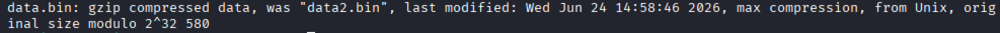

Then we rename the file and analyze it again so we can later decompress it:
```bash
$ mv data.bin data.gz
$ file data
```
Output: <mark>data: bzip2 compressed data, block size = 900k</mark>

Since it is compressed with _bzip2_, we can decompress it with the corresponding command:

```bash
$ mv data data.bz2
$ bunzip2 data.bz2
$ file data
```
Output: <mark>data: gzip compressed data, was "data4.bin", last modified: Wed Jun 24 14:58:46 2026, max compression, from Unix, original size modulo 2^32 20480</mark>

This process repeats until reaching the text file.

```bash
$ mv data data.gz
$ unzip data.gz
$ file data
```
Output: <mark>data: POSIX tar archive (GNU)</mark>

```bash
$ man tar
$ mv data data.tar
$ tar -xvf data.tar
$ file data5.bin
```
Output: <mark>data5.bin: POSIX tar archive (GNU)</mark>

```bash
$ tar -xvf data5.bin
$ file data6.bin
```
Output: <mark>data6.bin: bzip2 compressed data, block size = 900k</mark>

```bash
$ bunzip2 data6.bin
$ file data6.bin.out
```
Output: <mark>data6.bin.out: POSIX tar archive (GNU)</mark>

```bash
$ tar -xvf data6.bin.out
$ file data8.bin
```
Output: <mark>data8.bin: gzip compressed data, was "data9.bin", last modified: Wed Jun 24 14:58:46 2026, max compression, from Unix, original size modulo 2^32 49</mark>

```bash
$ gunzip data8.bin
$ mv data8.bin data8.gz
$ gunzip data8.gz
$ file data8
```
Output: <mark>data8: ASCII text</mark>

```bash
$ cat data8
```
Output: <mark>The password</mark>

<hr/>

## Level 13 -> Level 14
Next level's password is in _/etc/bandit_pass/bandit14_ and can only be read by user bandit14

There are only two files in the directory: HINT and passkey.private, which is the one we're interested in.

This file contains a key that will be used to connect to bandit14 without needing a password. 

However, when trying to connect through bandit13, it displays this message:

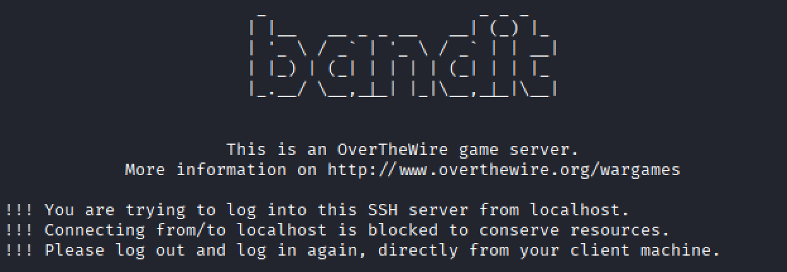

This means we must connect from outside the server. Since the required file is in bandit13, we have to move it to our machine:

```bash
$ scp -P 2220 bandit13@bandit.labs.overthewire.org:sshkey.private .   
```
In this case I moved it to the current working directory (.), but it's possible to move it to any path.

Now that it's on my device, I tried to connect to bandit14 using the key file.

```bash
$ ssh -i ./sshkey.private bandit14@bandit.labs.overthewire.org -p 2220
```
This message appeared when trying to access:

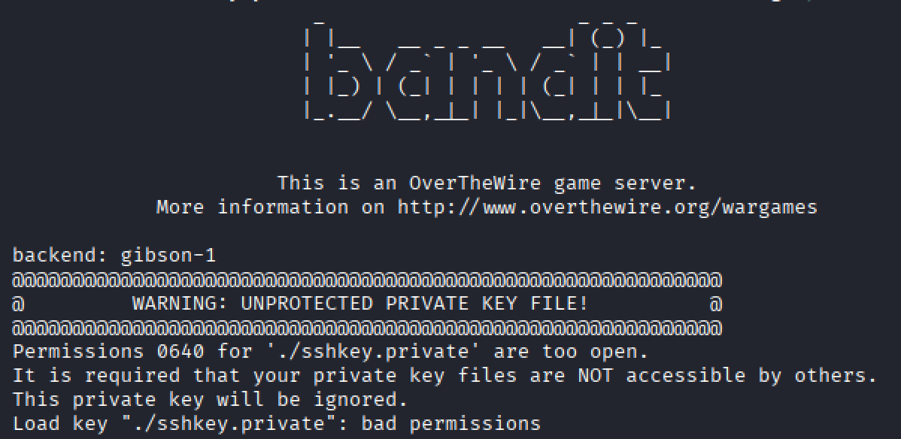

In order to remove this error, I changed the permissions to read only for the owner (all other permissions were revoked):

```bash
$ chmod 600 sshkey.private
```
After trying again we are now inside bandit14.

<hr/>

## Level 14 -> Level 15
The password can be obtained by using this level's password to port 30000 on localhost.

As stated in the previous level's description, the password for bandit14 is in _/etc/bandit_pass/bandit14_

```bash
$ cat /etc/bandit_pass/bandit14
```
This outputs bandit14's password.

To connect to localhost, we use telnet. Here we're supposed connect through port 30000:

```bash
$ telnet localhost 30000
```
**All of this while connected to bandit14 server**

This will prompt us for current level's password, and after pasting it, will return bandit15's password.

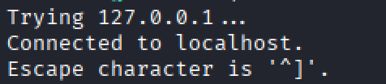

<hr/>

## Level 15 -> Level 16
To get the next password, current level's password should be submitted to port 30001 on localhost using SSL/TLS encryption.

In order to establish this safe connection, we use ```openssl```:

```bash
$ openssl s_client -connect localhost:30001
```

Then we input bandit15's password and get next level's.

<hr/>

## Level 16 -> Level 17
To get next level's password, we have to submit current level's password to a localhost port in the range 31000-32000. We have to find out the one that speaks SSL/TLS.

To find the open port we can use the following command:
``` bash
$ nmap -sC localhost -p 31000-32000
```
Here, -sC is used to run default scripts. This gives us more details of each port.
With this we find out the open port with SSL enabled is 31790.

Now we can send the password:
```bash
$ openssl s_client -connect localhost:31790 -ign_eof
```
Without the ```-ign_eof``` flag, which is triggered by the letter 'k'/'K', every time the password is entered, a KEYUPDATE message is displayed and the password isn't processed.

As a result we get a private key. Save that key in a file on your device and ensure it has as little permissions as possible using ```chmod```.

<hr/>

## Level 17 -> Level 18
The password is the only different line between _passwords.old_ and _passwords.new_
```bash
$ diff passwords.old passwords.new
```
The right password is the one that's only in _passwords.new_ (the arrow pointing to the right)

This won't allow the connection due to level bandit19.

<hr/>

## Level 18 -> Level 19
Next level's password is in a readme inside the home directory, but _.bashrc_ was modified to log us out when using SSH.

To bypass this modification, we just print the password from the file:
```bash
$ ssh bandit18@bandit.labs.overthewire.org -p 2220 'cat readme'
```
After adding this level's password, we get next level's.

<hr/>

## Level 19 -> Level 20
To access next level, we need to use the setuid binary in the home directory, and find the password in _/etc/bandit_pass_.

When we execute _bandit20-do_ (using ```./bandit20-do```), we get the following message:

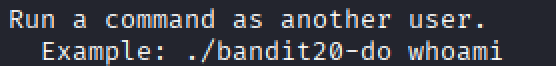

If we execute that command, we get the output "bandit20".

This means with this executable we can execute commands as if we were bandit20.

First we find out what's in _/etc/bandit_pass_:
```bash
$ ./bandit20-do ls /etc/bandit_pass
```
We get the files with all levels' passwords.

To visualize next level's:
```bash
$ ./bandit20-do cat /etc/bandit_pass/bandit20
```

<hr/>

## Level 20 -> Level 21
Here we have another binary that makes a connection to localhost with the port as an argument, then reads some text from the connection and compares it to bandit20's password. If it's correct, it transmits next level's password.

First we open another session with a connection to bandit20 and establish a connection using ```netcat```:
```bash
$ nc -lvp 1234
```
Here, ```-l``` listens for incoming connections, ```-p``` specifies the port, and ```-v``` produces verbose output.

On the other session we execute the binary, pointing it to the same port:
```bash
$ ./suconnect 1234
```
Afterwards, we paste bandit20's password on the session where ```nc``` is running and check the output.

<hr/>

## Level 21 -> Level 22
A program is running automatically at intervals from cron, whose configuration is in _/etc/cron.d/_

First, I saw the contents of _/etc/cron.d_ using ```ls```. I first looked into a file called _cronjob_bandit22_ using ```cat``` and found out it executes a shell script:

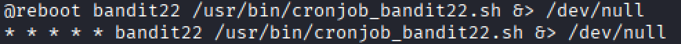

When displaying that shell script, we can see it actually passes the password onto another file:

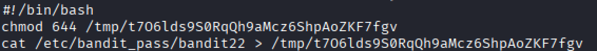

If we visualize the contents of that temporary file, we can see next level's password.

<hr/>

## Level 22 -> Level 23
Again, there is a program executing at regular intervals that's found in _/etc/cron.d/_

If we look inside _cronjob_bandit23_ until reaching the shell script (the same way as the previous level), we encounter this:

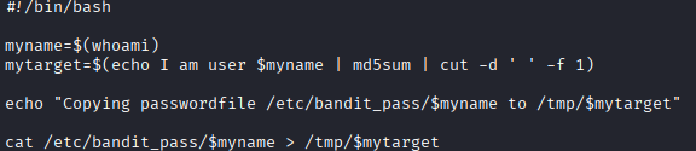

This script generates a hash based on the current user, takes the first column's output, and uses this hash for the temporary file where the password is being pushed.

We can use it to generate the hash, replacing ```$whoami``` with bandit23 and then reading the ```tmp``` file:

```bash
$ echo I am user bandit23 | md5sum | cut -d ' ' -f 1
$ cat /tmp/{hash}
```
<hr/>

## Level 23 -> Level 24
A program is running regularly at _/etc/cron.d/_: _cronjob_bandit24_. 

Following the same steps as the previous levels, we reach the shell script:

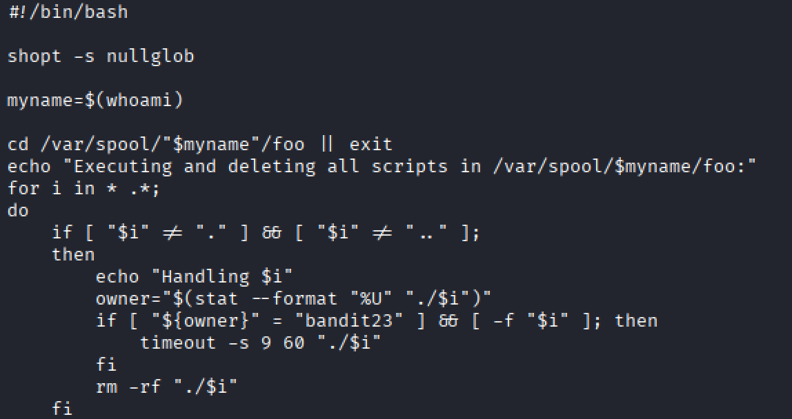

This script executes and deletes all files in _/var/spool/bandit24/foo_.

To do this, we can first generate a secure temporary directory so we can work comfortably and give it full permissions so the program can access it. Then we go to said directory:
```bash
$ mktemp -d
$ chmod 777 /tmp/tmp.{name}
$ cd /tmp/tmp.{name}
```
**Giving full permissions is not recommended, as anyone can read, write, and execute the file/directory**

Since the password is stored in _/etc/bandit_pass/bandit24_, we can create a shell script that returns its contents and adds it to a file in our _/tmp/_ directory. We give the file full permissions so the program can access it:
```bash
$ echo -e "#! /bin/bash  cat /etc/bandit_pass/bandit24 > /tmp/tmp.{name}/pass" > getpw.sh
$ chmod 777 getpw.sh
```
Then we create the file where the password will go and give it permissions so the program can write to it:
```bash
$ touch pass
$ chmod 777 pass
```
Finally, we copy the file to _/var/spool/bandit24/foo_, which is where the files are being executed:
```bash
$ cp getpw.sh /var/spool/bandit24/foo
```

After waiting a while, we can visualize the password inside the file using ```cat```.

<hr/>

## Level 24 -> Level 25
A daemon (program that runs in the background) listens on port 30002 and will give the pass for next level if given last level's plus a secret 4-digit pincode. The only way to obtain it is by going through all 10000 combinations.

To find the right pincode, we'll have to use a method known as brute-forcing, which means trying one by one until we find the right one:
```bash
$ for i in {0000..9999}; do echo "{bandit25 password} $i"; done | netcat localhost 30002 | grep -v "Wrong"
```
What this does is pass the numbers from 0000 to 9999 to the connection to port 30002 on localhost (which is where the daemon is listening). Then, it'll filter the output so we only see the line with the successful message.

<hr/>

## Level 25 -> Level 26
The shell for user bandit26 isn't _/bin/bash_. We're supposed to find our what is it and how to break out of it.

First, we can see which shell it's using by checking the following directory:
```bash
$ cat /etc/passwd | grep 26
```
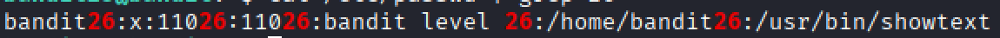

This indicates it's running showtext. Inside it, we can see it displays a file from bandit26 home directory called _text.txt_. At the top we can also see it doesn't have the ```#!/bin/bash``` header:

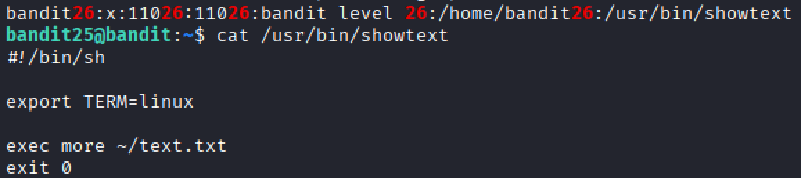

```more``` is used to display text in an interactive way when it's too large to fit in the terminal. It allows the use of Vim (text editor that also allows command execution). So in order to enter interactive mode, we need to make the terminal smaller than the display, execute the ssh script with the passkey (needs to be on your computer) and enter 'v':
```bash
$ ssh -i ./bandit26.sshkey bandit26@bandit.labs.overthewire.org -p 2220
```
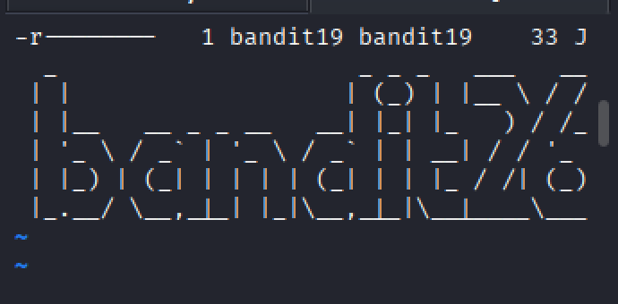

While in interactive mode, we write:
```bash
 :set shell=/bash/bin
 :shell
```
This sets the shell to _/bash/bin_ and enters the shell. Now we're inside bandit26.

<hr/>

## Level 26 -> Level 27
If we view the contents of bandit26 using ```ls```, we find out there's a program that allows execution from another user:

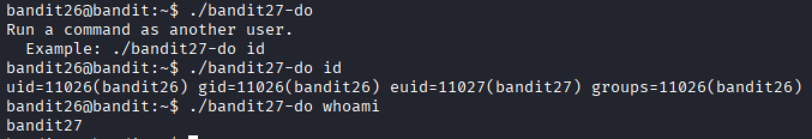

From here, we can view the directory containing each level's password. If we look at the one belonging to bandit27, we realize we have read permissions for that file.

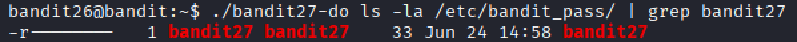

If we look inside that file using ```cat```, we can find the password.

<hr/>

## Level 27 -> Level 28
In this level we have to clone a repository on port 2220:
```bash
$ git clone ssh://bandit27-git@bandit.labs.overthewire.org:2220/home/bandit27-git/repo
```
This will ask for the previous level's password.

Once it finished cloning, we can visualize the repository's contents:
```bash
$ ls repo
```
This will show it contains a _README_ file.

The password can be found in this file:
```bash
$ cat repo/README
```
<hr/>

## Level 28 -> Level 29
Again, we have to clone a git repository to obtain the password on port 2220. Since _repo_ is already a repository and we're not using it anymore, we can delete it:
```bash
$ rm -rf repo
```
Now we can clone it, using last level's password:
```bash
$ git clone ssh://bandit28-git@bandit.labs.overthewire.org:2220/home/bandit28-git/repo
```
If we visualize the _README_ file inside (same as the previous level), we can see this:

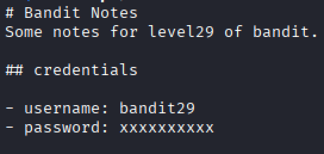

Looking at the password section, it's possible there was a previous version that contained the actual password.

So, we visualize the commit history, which shows the different versions of the repository. For the command to work, it has to be done from the _repo_ directory:
```bash
$ git log
```
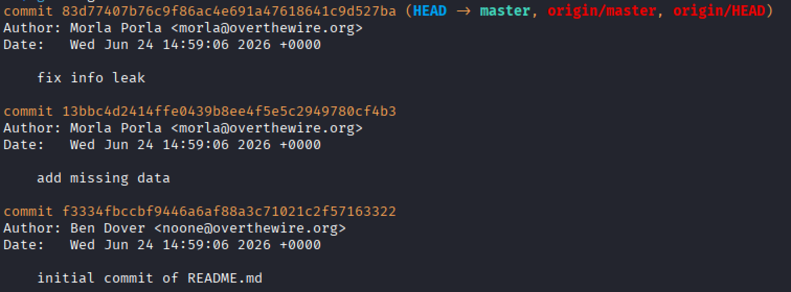

Here we can see there was an info leak fix.

To see this version:
```bash
$ git show {commit-id}
```
This outputs the previous version with the visible password.

<hr/>

## Level 29 -> Level 30
One more, we clone a git repository:
```bash
$ git clone ssh://bandit29-git@bandit.labs.overthewire.org:2220/home/bandit29-git/repo
```
If we look at the contents of _README.md_, we can see the password was never added to production.

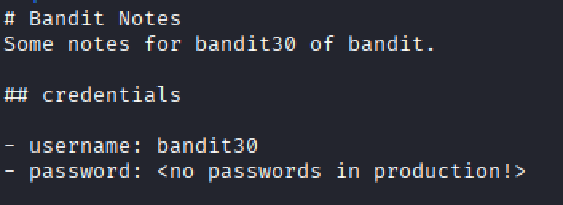

This implies it could have been added to the development branch.

To see all the branches:
```bash
$ git branch -a
```
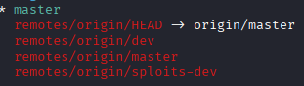

Here we can observe there is a _dev_ branch.

If we look at the history of that branch, we can see one of the commits contained data necessary for development:
```bash
$ git log remotes/origin/dev
```
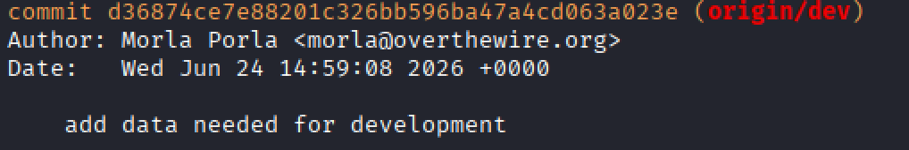

The password will be displayed if we see that version:
```bash
$ git show {commit id}
```
<hr/>

## Level 30 -> Level 31
We clone the repository:
```bash
$ git clone ssh://bandit30-git@bandit.labs.overthewire.org:2220/home/bandit30-git/repo
```
If we look at _README.md_, we can see it's empty.


The commits also only show the one where the file was written.

However, when we check the tags (pointers for a specific commit), we can see there is one called _secret_. The password will be shown if we view its contents:
```bash
$ git tag
$ git show secret
```
<hr/>

## Level 31 -> Level 32
We clone the repository:
```bash
$ git clone ssh://bandit31-git@bandit.labs.overthewire.org:2220/home/bandit31-git/repo
```
If we visualize the _README.md_ file, we see we have to push a file named _key.txt_ with the phrase 'May I come in?' to the master branch.

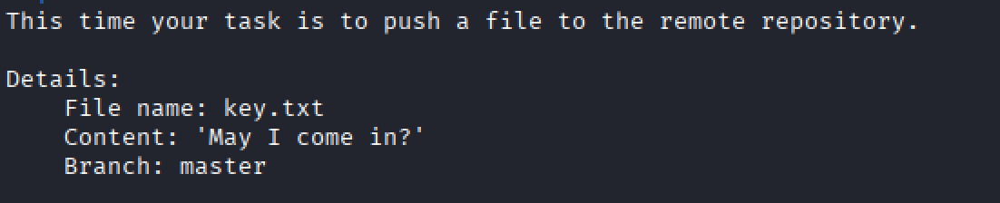

To do this, we first create the file:
```bash
$ nano key.txt
```
And insert the phrase without quotes.

It's also possible to use ```echo "May I come in"> cat key.txt``` to create the file

Then we add the file to the repo, commit it, and push it. Note we use ```-f``` in ```git add``` because otherwise the _.gitignore_ file (which is programmed to ignore all .txt files) would ignore it:
```bash
$ git add -f key.txt
$ git commit -m "Created key.txt"
$ git push origin main
```
After this, we'll get asked to input this level's password and will receive the next's.

<hr/>

## Level 32 -> Level 33
When we enter this level, we're stuck in a shell that turns every input into uppercase. Since the command-line is case-sensitive, it won't allow us to run any commands.

To bypass this, we can use:
```bash
$0
```
This parameter represents our current shell/interpreter, so it takes us to a regular command terminal.

From there, we can go to _/etc/bandit_pass/bandit33_ to find the password.

<hr/>

## Level 33 -> Level 34
This level is still in development. If we access bandit33, we can visualize the following message:

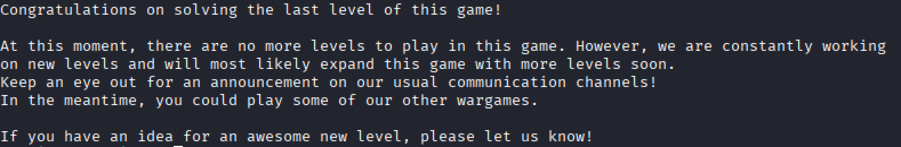

### Thank you for reading! 
